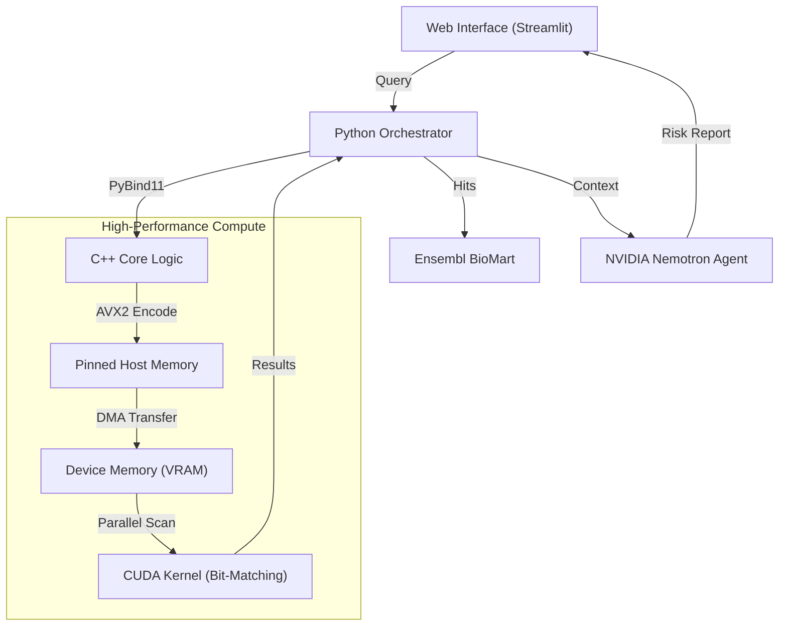

# C.O.R.E | CRISPR Off-target Real-time Engine


> **High-Performance Genomics Engine for Precision Medicine.**

> *Submitted for the nvidia GTC Golden Ticket Developer Contest.*

## Abstract

**C.O.R.E** (CRISPR Off-target Real-time Engine) is a high-performance bioinformatics platform designed to secure gene
editing workflows. By leveraging a hybrid **CPU/GPU architecture**, C.O.R.E scans the entire human genome in
milliseconds to identify potential off-target cuts. It integrates **NVIDIA Nemotron** to provide real-time clinical risk
assessment, bridging the gap between raw computation and patient safety.

## Key Features

### 1. Hyper-Optimized Search Engine (C++/CUDA)

* **Bit-Packed Genome:** The entire HG38 genome is compressed using a 2-bit encoding scheme, fitting into ~3GB of VRAM.
* **AVX2 SIMD Encoding:** Utilizing host CPU `_mm256` intrinsics for massive parallel sequence encoding before transfer.
* **Warp-Aggregated CUDA Kernel:** A custom "branchless" pattern matching algorithm designed to minimize warp divergence
  and maximize integer throughput on CUDA Cores.
* **Zero-Copy Latency:** Implements pinned host memory (Page-Locked) for maximum PCIe Gen4/5 bandwidth utilization.

### 2. Epigenomic Filtering

* Real-time integration of ATAC-seq data and ENCODE blacklists.
* Filters out inaccessible chromatin regions (heterochromatin) to drastically reduce False Positives compared to purely
  sequence-based tools.

### 3. AI Clinical Risk Assessment

* **Automated Annotation:** Maps off-target hits to gene features via Ensembl BioMart.
* **LLM Analysis:** Powered by **NVIDIA Nemotron**, acting as a clinical reasoning agent to evaluate the toxicity,
  oncogenicity, and functional impact of unintended edits.

---

## System Architecture

C.O.R.E demonstrates a highly efficient **Offloading Pattern**, using Python for orchestration and C++/CUDA for heavy
lifting.



---

## Performance Engineering

I targeted specific hardware bottlenecks to achieve real-time performance:

| Bottleneck       | Solution                               | Technology                                   |
|------------------|----------------------------------------|----------------------------------------------|
| Memory Bandwidth | Reduced global memory transactions     | **Warp-Level Primitives / Coalesced Access** |
| PCIe Latency     | Asynchronous transfers & mapped memory | **CUDA Streams / `cudaHostAlloc`**           |
| CPU Overhead     | Parallel data preparation              | **OpenMP / AVX2 Intrinsics**                 |
| Disk I/O         | Zero-overhead file reading             | **Memory Mapping (mmap) with Huge Pages**    |

---

## Installation & Build

### Prerequisites

- CMake 3.20+
- Ninja Build System
- CUDA Toolkit 12.9+
- C++20 Compiler (Clang/GCC)
- Python 3.14+

1. Build the C++/CUDA Engine

```shell
./scripts/setup_build.sh
cd build
ninja
```

2. Install Python Dependencies

```shell
pip install pipenv # if not installed on your machine
pipenv install
```

3. Data Setup

Place your genome files (`hg38_fa.fa`) and epigenome binaries in the `data/` directory.

```shell
python3 tools/build_epigenome.py --sizes hg38_full.sizes --output hg38_k562.epi --atac atac_peaks_k562.bed  --blacklist hg38_blacklist.bed --h3k4me3 h3k4me3_k562.bed --h3k27ac h3k27ac_k562.bed --ctcf ctcf_k562.bed --tss tss_windows.bed
```

---

## Usage

Launch the interactive web interface:

```shell
streamlit run app.py
```

1. **Select Genome:** Loads the HG38 genome (mapped into RAM/VRAM).
2. **Configure Enzyme:** Choose Cas9 (PAM: NGG) or Cas12a (PAM: TTTV).
3. **Input Guide:** Enter your 20-23nt sgRNA sequence.
4. **Analyze:** The system performs the GPU scan, retrieves gene contexts, and queries the LLM for a safety report.

---

## Acknowledgements & Scientific Advisory

While this project was developed as a solo entry, it relies on deep domain knowledge:

* **Lilia Ouadah** - Scientific Advisor
    * I would like to express my sincere gratitude for her guidance on CRISPR biological constraints, off-target
      validation criteria, and clinical relevance. Her mentorship ensured that this engineering challenge remained
      grounded in biological reality.
    * **Contact:** [l.ouadah@umcg.nl](mailto:l.ouadah@umcg.nl)
    * **LinkedIn:** [Lilia Ouadah](https://www.linkedin.com/in/lilia-ouadah-435a591b8/)

---

## Author

**Riyane El Qoqui**

* **GitHub:** [riyaneel](https://github.com/riyaneel/)
* **LinkedIn:** [Riyane El Qoqui](https://www.linkedin.com/in/riyaneel/)

> "Optimization is not just about speed; it's about making precision medicine accessible."

---

<div align="center">
    <sub><b>NVIDIA GTC Golden Ticket Developer Contest</b> | Solo Submission</sub>
    <sub>Built with ❤️ using NVIDIA Cuda & Nemotron</sub>
</div>